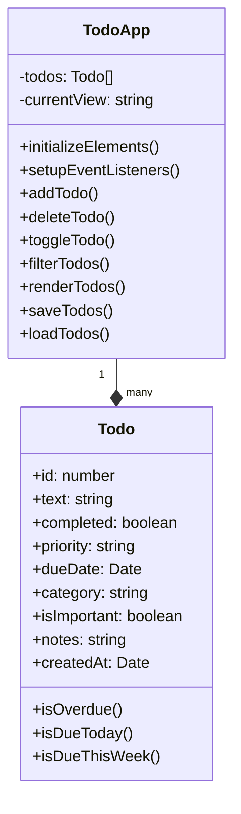
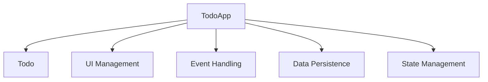
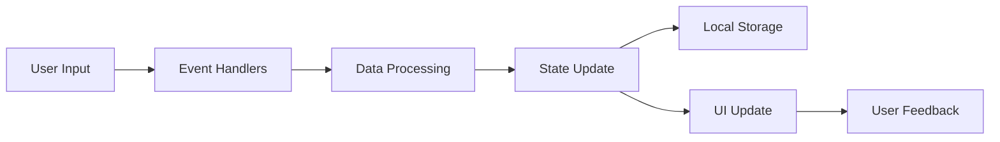

# TaskFlow - Todo Application Architectural Analysis

## Overview

TaskFlow is a modern, feature-rich todo application built using vanilla JavaScript with a focus on maintainability, user experience, and progressive enhancement. The application follows an object-oriented architecture with clean separation of concerns.

## System Architecture

## Technical Features

### 1. Core Functionality
- Task CRUD operations
- Task categorization and prioritization
- Due date management
- Task filtering and sorting
- Search functionality
- Important task flagging
- Task notes
- Completion tracking

### 2. UI/UX Features
- Dark/Light theme support
- Responsive design
- Toast notifications
- Modal dialogs
- Empty state handling
- Smooth animations
- Intuitive task management
- Statistics dashboard

### 3. Data Management
- Local storage persistence
- Data validation
- State management
- Real-time updates

## Code Organization

### 1. Class Structure

- **Todo Class**: Represents individual todo items with properties and helper methods
- **TodoApp Class**: Main application controller handling:
  - UI initialization
  - Event management
  - Data operations
  - State management
  - Rendering
  - User interactions

### 2. File Organization
- `index.html`: Application structure and layout
- `styles.css`: Comprehensive styling with CSS variables
- `app.js`: Application logic and class definitions

## UI/UX Design

### 1. Layout
- Sidebar navigation
- Main content area
- Modal dialogs
- Toast notifications
- Responsive breakpoints

### 2. Theme System
- CSS variables for consistent theming
- Dark/Light mode support
- Smooth transitions
- Accessible color schemes

### 3. Components
- Task input form
- Task list items
- Filter controls
- Statistics panel
- Navigation menu
- Modal dialogs
- Toast notifications

## Data Flow

## Performance Considerations

1. **DOM Manipulation**
   - Event delegation for task list interactions
   - Efficient rendering with innerHTML
   - Minimal reflows and repaints

2. **Data Management**
   - Efficient filtering and sorting algorithms
   - Local storage for persistence
   - Optimized state updates

3. **UI Performance**
   - CSS transitions for smooth animations
   - Efficient class toggling
   - Lazy loading of modal content

## Extensibility Points

1. **Data Layer**
   - Could be extended to support backend integration
   - Support for different storage mechanisms
   - Data sync capabilities

2. **UI Components**
   - Additional view options
   - More filtering criteria
   - Enhanced statistics
   - Custom themes

3. **Features**
   - Task sharing
   - Subtasks
   - Tags
   - Attachments
   - Recurring tasks
   - Reminders

## Potential Improvements

### 1. Technical Improvements
- Implement task subtasks
- Add support for markdown in notes
- Add data export/import functionality
- Implement undo/redo functionality
- Add keyboard shortcuts
- Implement drag-and-drop reordering

### 2. UI Improvements
- Add task list view options (list/grid)
- Add task grouping by date/category
- Enhance statistics with charts
- Add custom category colors
- Improve mobile navigation

### 3. Data Management
- Add data backup functionality
- Implement data sync
- Add multi-device support
- Enhance search with filters
- Add bulk operations

### 4. Performance Optimizations
- Implement virtual scrolling for large lists
- Add task list pagination
- Optimize storage usage
- Add service worker for offline support
- Implement lazy loading for task details

## Security Considerations

1. **Data Safety**
- Input sanitization
- XSS prevention
- Safe storage practices

2. **Privacy**
- No sensitive data exposure
- Clear data management policies
- User data control

## Conclusion

TaskFlow demonstrates a well-structured, maintainable, and user-friendly todo application architecture. Its modular design and clean separation of concerns make it both maintainable and extensible. The application successfully balances features with performance while maintaining a focus on user experience.